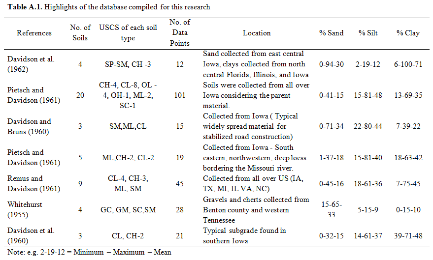
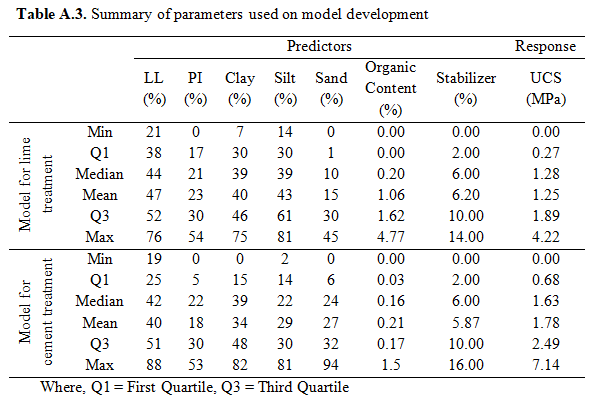
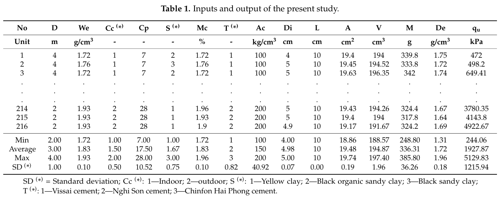
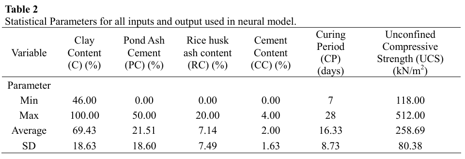
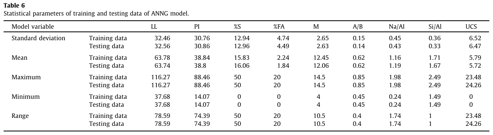
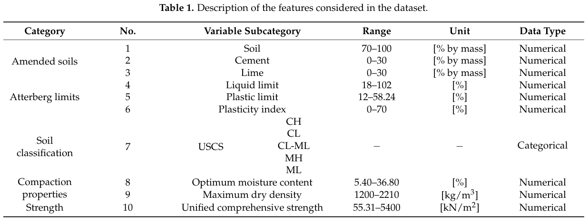
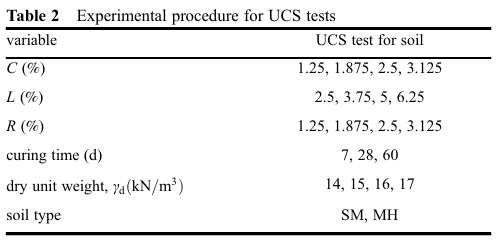
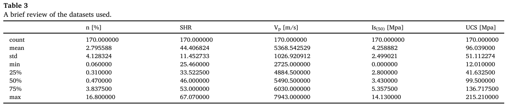
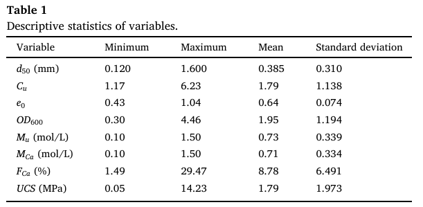
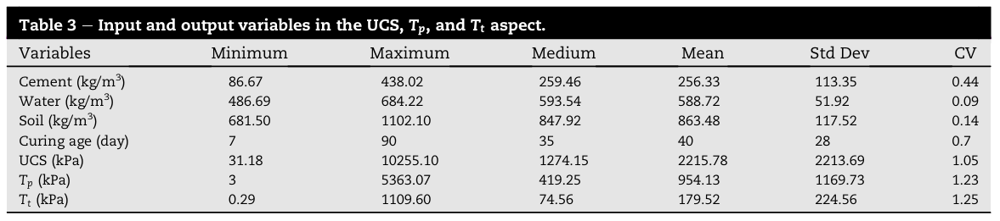

# AutoML-Based Forecasting of Unconfined Compressive Strength of Stabilized Soils at a Global Scale

This project uses **AutoML** with a focus on different libraries. To ensure compatibility between libraries, it is necessary to use specific versions of Python and the packages involved.

**It is highly recommended to run the project on Linux**. If you are using Windows, it is recommended to use WSL (Windows Subsystem for Linux). In addition, it is recommended to use the `poetry` library.
These recommendations aim to ensure better compatibility and performance of the libraries involved.

Before running the project, be sure to configure the `pyproject.toml` file and run the virtual environment through poetry with the following versions:

- **AutoGluon** 0.7.0
- **AutoKeras** 1.0.20
- **CMake** 3.28.3
- **Cython** 3.1.3
- **FLAML** 1.2.4
- **g++** 13.3.0
- **H2O** 3.44.0.3
- **Jinja2** 3.1.6
- **Joblib** 1.5.1
- **Keras-Tuner** 1.4.7
- **Matplotlib** 3.9.4
- **NumPy** 1.23.5
- **OpenJDK** 21.0.8
- **Openpyxl** 3.1.2
- **Pandas** 1.5.3
- **Permetrics** 2.0.0
- **Pip** 25.2
- **Poetry** 1.8.2
- **Python** 3.9.23
- **Scikit-Learn** 1.2.2
- **Scipy** 1.11.4
- **Seaborn** 0.12.2
- **Skillmetrics** 1.1.8
- **TPOT** 0.12.1
- **Tensorflow** 2.9.3

# File "read_data_ucs.py"

Read 10 datasets with information about the Unconfined Compressive Strength (UCS) of soils.

**Datasets**
Here are the datasets and related functions/papers:
* Dataset 'D1': "read_gajurel" (treatment='Lime')
* Dataset 'D2': "read_gajurel" (treatment='Cement')
* Dataset 'D3': "read_ngo"
* Dataset 'D4': "read_priyadarshee"
* Dataset 'D5': "read_mozumder"
* Dataset 'D6': "read_taffese"
* Dataset 'D7': "read_tabarsa"
* Dataset 'D8': "read_mahmoodzadeh"
* Dataset 'D9': "read_wang"
* Dataset 'D10': "read_zhang"
* Dataset 'RCA': "read_yuan" (not used in this study)
* Dataset 'D0S': "read_burroughs" (already considered in the dataset D6)
* Dataset 'S1': "read_jalal" (not used in this study)

## Datasets 'D1 e D2': function "read_gajurel"

**Title**: Machine learning methods to map stabilizer effectiveness based on common soil properties

**Authors and year**: Gajurel et al., 2020

**Journal**: [Transportation Geotechnics](https://doi.org/10.1016/j.trgeo.2020.100506)

**Abstract**

Most chemical stabilization guidelines for subgrade/base use unconfined compressive strength (UCS) of treated soils as the primary acceptance criteria for selecting optimum stabilizer in laboratory testing. Establishing optimal additive content to augment UCS involves a resource-intensive trial-and-error procedure. Also, samples collected from discrete locations for laboratory trials may not be representative of the overall site. This study aims to minimize the number of laboratory trials and help strategize sampling locations by developing spatial maps of UCS at different treatment levels for lime and cement. These spatial maps were developed using machine-learning techniques, and using a database compiled from various reported studies on lime and cement stabilization of soils in the United States. Supervised learning methods under regression and classification categories were used to quantify and classify UCS values after treatments, respectively. Commonly available soil properties like Atterberg limits, gradation, and organic contents along with treatment type and amount were used as predictors and UCS values as the response. Median R2 for the best regression model was 0.75 for lime and 0.82 for cement, while the Correct Prediction Rate (CPR) for the best classification model was 92\% for lime and 80\% for cement. Results showed that satisfactory predictions could be made regarding stabilizer effectiveness using simple soil information commonly available. Best performing models for cement treatment were selected for generating the spatial maps for two counties in Montana. Soil samples collected from these counties were tested with different cement contents to verify the predictions. The results indicate that the Pearson's correlation coefficient for the regression model was 0.78 and CPR for the classification model was 92\%. The authors hope that this study and future studies like these will increase data-driven-decision-making in geotechnical engineering practices.

**Introduction**

Soil samples are prepared using the initial estimates and tested for unconfined compressive strengths (UCS). This process is iterated for different types and amounts of stabilizers until a target strength is achieved. For obtaining a single UCS value for a given type and amount of stabilizer, <mark>testing procedure generally takes 7–28 days</mark> excluding sample preparation time. Also, since randomly selected sampling locations are put through this process, the optimized stabilizer type and amount may not be representative of the entire site. As a solution to these problems, the current study is focused on developing machine learning models that could predict optimal stabilizer amounts using simple soil properties. This predicted amount can then be verified quickly in the laboratory, thereby <mark>the proposed machine learning based method minimizes the time and effort required for establishing optimal stabilizer amounts</mark>. Moreover, these models can generate spatial maps of stabilizer effectiveness that can help strategize sampling locations for laboratory testing.

In this study, <mark>a database of UCS values and corresponding treatment along with associated Atterberg limits, particle size distribution, and organic content of the soil was compiled from various research studies</mark>. This database was subsequently used to train and test different supervised machine learning models. The <mark>regression models</mark> studied herein include <mark>multiple linear regression (MLR), generalized additive models (GAM), K-nearest neighbors (KNN), and support vector machine (SVM)</mark>, and <mark>classification models</mark> include <mark>logistic regression (LR), discriminant analysis, KNN, and SVM</mark>. The regression models generate quantitative predictions (actual value of UCS), whereas the classification models generate categorical predictions (pass/fail for a given threshold UCS value).

**Previously published databases**

**Parameters**

## Dataset 'D3': function "read_ngo"

**Title**: Application of Artificial Intelligence to Determined Unconfined Compressive Strength of Cement-Stabilized Soil in Vietnam

**Authors and year**: Ngo et al., 2021

**Journal**: [Applied Sciences](https://doi.org/10.3390/app11041949)

**Abstract**

Cement stabilized soil is one of the commonly used as ground reinforcement solutions in geotechnical engineering. In this study, the main object was to apply three machine learning (ML) methods namely gradient boosting (GB), artificial neural network (ANN) and support vector machine (SVM) to predict unconfined compressive strength (UCS) of cement stabilized soil. Soil samples were collected at Hai Duong city, Vietnam. A total of 216 soil–cement samples were mixed in the laboratory and compressed to determine the UCS. This data set is divided into two parts of the training data set (80%) and testing set (20%) to build and test the model, respectively. To verify the performance of ML model, various criteria named correlation coefficient (R), mean absolute error (MAE) and root mean square error (RMSE) were used. The results show that all three ML models were effective methods to predict the UCS of cement-stabilized soil. Amongst three model used in this study, optimized ANN model provided superior performance compare to two others models with performance indicator R = 0.925, RMSE = 419.82 and MAE = 292.2 for testing part. This study can provide an effective tool to quickly predict the UCS of cement stabilized soil with high accuracy.

**Introduction**

Among the soft soil reinforcement methods, the cement-stabilized sandy soil method has been used for many years \[9,10\]. The cementation of sandy soil can increase the hardness, shear strength and compressive strength of the material \[9\].

Through many studies it can be found that the UCS value is an important parameter to evaluate the bearing capacity of cement-stabilized soil \[3,9\].

**Parameters**

* S: soil type
* Mc: moisture content
* We: wet density
* D: sampling depth
* Ac: amount of cement

Factors related to the sample after mixing:
* Di: specimen diameter
* L: specimen length
* A: specimen area
* V: specimen volume
* M: specimen mass
* De: specimen density

Other important factors:
* Cc: curing condition
* Cp: curing period (probably in days)
* T: type of cement

Output:
* qu: UCS of the cement–soil mixture

## Dataset 'D4': function "read_priyadarshee"

<mark>The link in the “reference” field is wrong.</mark>

**Title**: Neural Models for Unconfined Compressive Strength of Kaolin Clay Mixed with Pond Ash, Rice Husk Ash and Cement

**Authors and year**: Priyadarshee et al., 2020

**Journal**: [Journal of Soft Computing in Civil Engineering](https://doi.org/10.22115/SCCE.2020.223774.1189)

**Abstract**

In this study an Artificial Neural Network (ANN) model was used to predict the Unconfined Compressive Strength (UCS) of Kaolin clay mixed with pond ash, rice husk ash and cement content model under different curing period. The input parameters included percentages of admixtures added along with clay content and curing period. The curing Period range was 7, 14 and 28 days considered in neural model. The feedforward back propagated neural model with Levenberg Marqaurdt gradient descent with momentum constant was used to predict the UCS and optimized topology of 5-10-1 was obtained. The sensitivity analysis based on weights of neural model indicated that all admixtures contributed 70% to the UCS of Kaolin clay. The comparison of ANN model with Multiple Regression Analysis (MRA) model indicated that ANN models were performing better than MRA model with values of r as R2 as 0.98 and 0.97 respectively in testing phase of neural model and for MRA model r was 0.94 and R2 as 0.88.

**Introduction**

To improve the engineering behavior of soil, different cementing and non-cementing materials are available. Lime, cement etc. are the example of cementing material, while fly ash, pond ash, rice husk ash etc. are the examples of non-cementing materials which are by-products of other processes and also a better waste management option. Many researchers have studied the behavior soil mixed with different admixtures like lime, cement, fibers, fly ash etc. \[1–10\]. All such studies have shown that these materials have potential to improve the strength behavior of soil.

Based upon the laboratory results many prediction models using <mark>multiple regression analysis</mark> are developed to estimate the strength behavior of soil-admixture mix \[10\]. These models have to be fitted with variable polynomial functions and type of polynomial which is time consuming and yields results which <mark>cannot capture non-linearity</mark> \[25\].

From the literature study, it was identified that ANN models have not been used for soils like clay stabilized with waste material like pond ash and rice husk ash in combination with cement.

**Parameters**

The experiments conducted on Kaolin clay for its unconfined compressive strength had variable parameters such as <mark>clay content (C), Pond ash (PC), Rice husk ash content (RC), Cement content (CC) and Curing Period (CP)</mark>. Therefore, these variable parameters were used as input data during the development of the model. Unconfined compressive strength (UCS) was considered as target data or output data.

## Dataset 'D5': function "read_mozumder"

**Title**: Prediction of unconfined compressive strength of geopolymer stabilized clayey soil using Artificial Neural Network

**Authors and year**: Mozumder & Laskar, 2015

**Journal**: [Computers and Geotechnics](http://dx.doi.org/10.1016/j.compgeo.2015.05.021)

**Abstract**

Viability of Artificial Neural Network (ANN) in predicting unconfined compressive strength (UCS) of geopolymer stabilized clayey soil has been investigated in this paper. Factors affecting UCS of geopolymer stabilized clayey soil have also been reported. Ground granulated blast furnace slag (GGBS), fly ash (FA) and blend of GGBS and FA (GGBS + FA) were chosen as source materials for geo-polymerization. 28 day UCS of 283 stabilized samples were generated with different combinations of the experimental variables. Based on experimental results ANN based UCS predictive model was devised. The prediction performance of ANN model was compared to that of multi-variable regression (MVR) analysis. Sensitivity analysis employing different methods to quantify the importance of different input parameters were discussed. Finally neural interpretation diagram (NID) to visualize the effect of input parameters on UCS is also presented.

**Introduction**

Any pozzolanic material containing source of silica and alumina that is readily dissolved in the alkaline solution acts as a source of geopolymer precursor species and lends itself to geopolymerization \[1\]. Geopolymerization involves the poly-condensation reaction of geopolymeric precursors i.e. alumino-silicate oxide with alkali polysiliates yielding polymeric Si–O–Al bond as shown below \[2–4\].

**Parameters**

An ANN based predictive model designated as ANNG (ANN model for geopolymer) was developed. ANNG has <mark>liquid limit (LL), plasticity index (PI),percentage GGBS (%S), percentage FA (%FA), molar concentration (M), alkali to binder ratio(A/B), Na/Al and Si/Al as input parameters</mark> and 28 day UCS in MPa as output parameter.

MVR (multi-variable regression) model was developed with UCS as dependent variable and LL, PI, %S, %FA, M, A/B, Na/Al and Si/Al as independent variables.

## Dataset 'D6': function "read_taffese"

**Title**: Artificial Intelligence for Prediction of Physical and Mechanical Properties of Stabilized Soil for Affordable Housing

**Authors and year**: Taffese & Abegaz, 2021

**Journal**: [Applied Sciences](https://doi.org/10.3390/app11167503)

**Abstract**

Soil stabilization is the alteration of physicomechanical properties of soils to meet specific engineering requirements of problematic soils. Laboratory examination of soils is well recognized as appropriate for examining the engineering properties of stabilized soils; however, they are labor-intensive, time-consuming, and expensive. In this work, four artificial intelligence based models (OMC-EM, MDD-EM, UCS-EM+, and UCS-EM−) to predict the optimum moisture content (OMC), maximum dry density (MDD), and unconfined compressive strength (UCS) are developed. Experimental data covering a wide range of stabilized soils were collected from previously published works. The OMC-EM, MDD-EM, and UCS-EM− models employed seven features that describe the proportion and types of stabilized soils, Atterberg limits, and classification groups of soils. The UCS-EM+ model, besides the seven features, employs two more features describing the compaction properties (OMC and MDD). An optimizable ensemble method is used to fit the data. The model evaluation confirms that the developed three models (OMC-EM, MDD-EM, and UCS-EM+) perform reasonably well. The weak performance of UCS-EM− model validates that the features OMC and MDD have substantial significance in predicting the UCS. The performance comparison of all the developed ensemble models with the artificial neural network ones confirmed the prediction superiority of the ensemble models.

**Introduction**

The complexity of the behavior of the natural soil coupled with their spatial variability and the addition of stabilizers makes the development of reliable OMC, MDD, and UCS physics-based prediction models challenging. Unlike a physics-based system that performs a task by following explicit rules, such a complex problem requires intelligent systems that learn from experience. <mark>Learning a complex behavior using an artificial intelligence (AI) method is thus the best alternative</mark>.

The earlier work's attempt to predict OMC, MDD, and UCS of stabilized soils using AI approaches are encouraging. Though several types of AI algorithms can solve complex nonlinear regression problems efficiently, most of the works mainly utilized ANN. Indeed, ANN is one of the commonly applied approaches to solve several civil engineering problems, and some practical examples can be found in \[15–18\]. However, <mark>ANN has several limitations</mark>. For instance, a reasonable interpretation of the overall structure of the network is often challenging, and they do not provide information about the relative importance of the predictors. ANN is also not always superior to other AI models to solve problems, and it is impossible to comprehend which algorithm would surpass for a given problem all the time. As a show case, the work of Das et al. \[8\] demonstrated that SVM outperforms ANN models in predicting the MDD and UCS of cement-stabilized soil. In addition, <mark>the majority of the previous works employed a low number of data obtained mainly from a single experimental study</mark>.

In this work, models based on an <mark>ensemble of regression trees (bagging or boosting)</mark> are developed to predict OMC, MDD, and UCS of stabilized soils. The main contribution of this work is the development of OMC, MDD, and UCS prediction models using ensemble methods and employing a wide range of stabilized soils acquired from different countries around the globe.

**Previously published databases**

* Aytekin and Nas 1998
* Bell 1989
* Harichane et al. 2010; 2011
* Hasan et al. 2016
* Phanikumar and Ramanjaneya Raju 2020
* Siddique and Hossain 2011
* Burroughs 2001
* Workie and Alam 2019
* Solanki, Khoury, and Zaman 2009

**Parameters**

## Dataset 'D7': function "read_tabarsa"

**Title**: Unconfined compressive strength prediction of soils stabilized using artificial neural networks and support vector machines

**Authors and year**: Tabarsa et al., 2021

**Journal**: [Frontiers of Structural and Civil Engineering](https://doi.org/10.1007/s11709-021-0689-9)

**Abstract**

This study aims to improve the unconfined compressive strength of soils using additives as well as by predicting the strength behavior of stabilized soils using two artificial-intelligence-based models. The soils used in this study are stabilized using various combinations of cement, lime, and rice husk ash. To predict the results of unconfined compressive strength tests conducted on soils, a comprehensive laboratory dataset comprising 137 soil specimens treated with different combinations of cement, lime, and rice husk ash is used. Two artificial-intelligence-based models including artificial neural networks and support vector machines are used comparatively to predict the strength characteristics of soils treated with cement, lime, and rice husk ash under different conditions. The suggested models predicted the unconfined compressive strength of soils accurately and can be introduced as reliable predictive models in geotechnical engineering. This study demonstrates the better performance of support vector machines in predicting the strength of the investigated soils compared with artificial neural networks. The type of kernel function used in support vector machine models contributed positively to the performance of the proposed models. Moreover, based on sensitivity analysis results, it is discovered that cement and lime contents impose more prominent effects on the unconfined compressive strength values of the investigated soils compared with the other parameters.

**Introduction**

This study was conducted to predict the UCS values of silty sand and high plasticity silt treated with 5%–15% cement, lime, and rice husk ash (CLR) mixtures. To determine the UCS improvement rate, the curing time was varied from 7 to 60 days. Moreover, a set of treated samples without RHA (rice husk ash) was tested to identify its effect on soil strength. <mark>Two types of ANN architectures and an SVM method using two kernel functions were adopted</mark> to predict and compare the UCS values of the treated samples.

**Parameters**

* Soil type
* Dry unit weight - $\gamma_d$ (gamma_d)
* Curing time
* Cement (C)
* Lime (L)
* Rice husk ash (R)
* UCS (q_u)

## Dataset 'D8': function "read_mahmoodzadeh"

**Title**: Artificial intelligence forecasting models of uniaxial compressive strength

**Authors and year**: Mahmoodzadeh et al., 2021

**Journal**: [Transportation Geotechnics](https://doi.org/10.1016/j.trgeo.2020.100499)

**Abstract**

The uniaxial compressive strength (UCS) is a vital rock geomechanical parameter widely used in rock engineering projects such as tunnels, dams, and rock slope stability. Since the acquisition of high-quality core samples is not always possible, researchers often indirectly estimate these parameters. The main objective of the present study is to evaluate the performance of the long short term memory (LSTM), deep neural networks (DNN), K-nearest neighbor (KNN), Gaussian process regression (GPR), support vector regression (SVR), and decision tree (DT) to predict the UCS of different rock types of Claystone, Granite, Schist and Sandstone, Travertine, Limestone, Slate, Dolomite and Marl acquired from almost all quarry locations of Iran. 170 data sets, including porosity (n), Schmidt hammer (SH), P-wave velocity (Vp), and point load index (Is(50)) were applied in the methods. Finally, a comparison was made between the results made by the prediction methods. To assess the performance ability of the applied methods, the 5-fold cross-validation (CV) was considered. The results proved that computational intelligence approaches are capable of predicting UCS. On the whole, the GPR with a correlation coefficient (R2) of 0.9955 and a route mean square error (RMSE) of 0.52169, performs best. Lastly, the UCS prediction intelligence methods were ordered as GPR, DT, SVR, LSTM, DNN and KNN, respectively.

**Introduction**

Such studies all have shown more precision in using soft computing methods to forecast UCS than conventional statistical models. The fundamental drawback to these approaches is that, in most situations, the interaction between inputs and results does not provide a deterministic mathematical pattern. This indicates that such approaches are not as straightforward and understandable as regression-based models and empirical formulas, that’s why they are called “black box” \[18\].

**Parameters**

## Dataset 'D9': function "read_wang"

**Title**: Unconfined compressive strength of bio-cemented sand: state-of-the-art review and MEP-MC-based model development 

**Authors and year**: Wang & Yin, 2021

**Journal**: [Journal of Cleaner Production](https://doi.org/10.1016/j.jclepro.2021.128205)

**Abstract**

As a clean and sustainable method, the microbially induced calcite precipitation (MICP) approach has been widely used for reinforcing weak soils. This study presents a state-of-the-art review on the unconfined compressive strength (UCS) of bio-cemented sand treated by MICP, followed by the high-performance prediction using a machine learning algorithm combined with the Monte-Carlo (MC) method. First, various influencing parameters affecting the UCS of bio-cemented sand are identified, such as initial relative density, angularity of particle shape, bacterial concentration, precipitated calcium carbonate content, temperature and degree of saturation. Besides, the particle size distribution, urea and calcium concentration, and initial pH level also influence the UCS of the bio-cemented sand, but the effects remain contradictory or unclear. Following the state-of-the-art review, a large database covering 351 bio-cemented sand samples is developed, with the UCS as the output and seven influencing parameters (median grain size, coefficient of uniformity, initial void ratio, optical density of bacterial suspension, urea concentration, calcium concentration and precipitated calcium carbonate content) as inputs for the correlation. The multi expression programming (MEP) method combined with the MC method is proposed to develop the prediction models. All data groups randomly generated from the database are with 80% of the samples as the training sets and 20% as the testing sets. Finally, the optimal prediction model is selected with the lowest mean absolute error, further based on the analyses of monotonicity, sensitivity and robustness regarding more general applications.

**Introduction**

Generally, there are two categories of conventional soil improvement approaches: physical technology and chemical grouting (Mujah et al., 2017). The physical technology includes surcharge loading, pile installation, deep compaction (Shen et al., 2008; Jin et al., 2018; Chen et al. 2019a, 2020; Wang and Chen, 2019; Wang et al. 2019a, 2019b, 2019b; Qi et al., 2020), etc., normally consuming substantial energy resources, and causing soil disturbance and noise in the vicinity. The chemical grouting comprises of the treatment with lime, cement, fly ash (Yin and Zhou, 2009; Jiang and Yin, 2014; Yuan et al., 2016; Shen et al., 2017; Chen et al., 2019c), etc., which is chemicallytoxic and environmentally contaminating. Considering the limitations of the current technologies used for soil improvement, a new sustainable, efficient, economic and environmentally friendly approach is needed.

In the past two decades, a novel sustainable and economic bio-treatment method, microbially induced calcite precipitation (MICP), has been proposed and widely used on sand. The MICP approach is based on the application of urease-active bacteria and cementitious solution, showing less environmentally contaminating and more sustainable characteristics compared to conventional methods (Mitchell and Santamarina, 2005; DeJong et al. 2006, 2013; Whiffin et al., 2007; Ivanov and Chu, 2008; Chu et al., 2012; Montoya et al., 2013; Gomez et al., 2017; Mujah et al., 2017; Wang et al., 2017; Jiang et al., 2020; Liu et al., 2020; Tang et al., 2020; Xiao et al. 2020a, 2020b).

Therefore, it is feasible to use the <mark>MEP (multi expression programming)</mark> approach to predict the UCS of the MICP-treated sand, as supported by the previous successful applications of the MEP approach in geotechnical engineering. In addition, to avoid local minimum problem, the Monte-Carlo (MC) method is worth being applied to the MEP approach to obtain a more reliable optimal prediction model.

**Previously published databases**

* Al Qabany and Soga, 2013
* Cheng et al. 2013
* Cheng et al. 2014a
* Cheng et al. 2017
* Mahawish et al. 2018
* Mahawish et al. 2019
* Mujah et al., 2019
* Nafisi et al., 2020
* van Paassen et al., 2010
* Wang et al., 2020b
* Wen et al., 2019
* Xiao et al., 2019a
* Zhao et al., 2014

**Parameters**

* median grain size (d50)
* coefficient of uniformity Cu
* initial void ratio e0
* optical density of bacterial suspension OD600
* urea concentration Mu
* calcium concentration MCa
* calcium carbonate content FCa

## Dataset 'D10': function "read_zhang"

**Title**: Mixture optimisation for cement-soil mixtures with embedded GFRP tendons

**Authors and year**: Zhang et al., 2022

**Journal**: [Journal of Materials Research and Technology](https://doi.org/10.1016/j.jmrt.2022.02.076)

**Abstract**

The glass fiber-reinforced polymer (GFRP) rebar reinforced cemented soil is widely employed to solve the weak foundation problem led by sludge particularly. The robustness of this structure is highly dependent on the interface bond strength between the GFRP tendon and cemented soils. However, its application is obstructed owing to the deficient studies on the influence factors. Therefore, this study investigates the effects of water content (Cw: 50%–90%), cement proportion (Cc: 6%–30%), and curing period (Tc: 28–90 days) on peak and residual interface bond strengths (Tp and Tt), as well as the unconfined compression strength (UCS). Results indicated that mechanical properties were positively responded to Tc and Cc, while negatively correlated to Cw. Besides, Random Forest (RF), one of the machine learning (ML) models, was developed with its hyperparameters tuned by the firefly algorithm (FA) based on the experimental dataset. The pullout strength was predicted by the ML model for the first time. High correlation coefficients and low root-mean-square errors verified the accuracy of established RF-FA models in this study. Subsequently, a coFA-based multi-objective optimisation firefly algorithm (MOFA) was introduced to optimise tri-objectives between UCS, Tp (or Tt), and cost. The Pareto fronts were successfully acquired for optimal mixture designs, which contributes to the application of GFRP tendon reinforced cemented soil in practice. In addition, the sensitivity of input variables was evaluated and ranked.

**Introduction**

However, only cement-soil composite alone is deficient to withstand the lateral earth pressure in foundation pit support and blocking surface water. The utilisation of steel rebar as part of the structure combined with cement-soil matrix is one safer way to sustain the exterior load \[12-14\]. However, the performance of the whole composite is inevitably degraded by the steel corrosion during its usage which has an especially serious impact on permanent structures \[15-18\]. In case of degradation, the glass fiber reinforced polymer (GFRP) becomes a new tendon material to displace the steel for its excellent engineering characteristics and high affordability \[19-23\].

In this study, compressive and pullout strengths were carried out to investigate the impact of <mark>three variables (Cc, Cw, Tc)</mark> on GTRCS (interface bond performance of GFRP tendon-reinforced cemented soils).

**Parameters**

As mentioned above, <mark>the variables are the cement proportion, water content, and curing period</mark>. These variables can be used to compute the mass ratio of the raw materials (cement, water and soil). <mark>The out puts are the compressive strengt hand peak and residual pullout strengths with their datasets derived from the mechanical tests</mark>. Table 3 summarizes the basic database information for including raw materials and UCS, Tp, and Tt.

## Dataset 'RCA': function "read_yuan"

<mark>This study it's about concrete, not soils.</mark>

**Title**: Machine Learning Prediction Models to Evaluate the Strength of Recycled Aggregate Concrete 

**Authors and year**: Yuan et al., 2022

**Journal**: [Materials](https://doi.org/10.3390/ma15082823)

**Abstract**

In this research, the compressive and flexural strengths of RAC were predicted using ensemble machine learning methods, including gradient boosting and random forest.

## Dataset 'S1: function "read_jalal"

<mark>This study does not predict the UCS, but the compaction parameters.</mark>

**Title**: Predicting the compaction characteristics of expansive soils using two genetic programming-based algorithms 

**Authors and year**: Jalal et al., 2021

**Journal**: [Transportation Geotechnics](https://doi.org/10.1016/j.trgeo.2021.100608)

**Abstract**

In this study, gene expression programming (GEP) and multi gene expression programming (MEP) are utilized to formulate new prediction models for determining the compaction parameters (ρdmax and wopt) of expansive soils.

## Comments about librarys and variables

**pylab library**

* What it is: A module in Matplotlib providing a MATLAB-like interface for plotting and numerical computing by combining pyplot and NumPy functions.
* Why it was used: Convenience for users migrating from MATLAB and for concise code in interactive sessions.
* Why it's discouraged: Namespace pollution and lack of clarity due to wildcard imports.
* Recommended alternative: Explicitly import matplotlib.pyplot and numpy.

**`np.bool_` variable**

NumPy also provides `np.bool_`, which is a distinct NumPy-specific boolean scalar type. While `np.bool` was an alias for the Python `bool`, `np.bool_` represents a NumPy scalar type optimized for array operations. In NumPy 2.0, `np.bool_` was renamed to `np.bool`, and `np.bool_` became an alias for the new `np.bool` for backward compatibility. This can lead to confusion, but the general recommendation is to use `bool` for type hinting and `np.bool_` (or the new `np.bool` in NumPy 2.0 and later) for creating boolean arrays or specifying the dtype of arrays.

**Function "lhsu"**

Defined but not used.

**Variable `__name__`**

In Python, `__name__` is a special built-in variable that holds the name of the current module. Its value changes depending on how the Python file is executed: 

* When a script is run directly:
If a Python file is executed as the main program (e.g., `python your_script.py`), the `__name__` variable within that file is automatically set to the string `"__main__"`.
* When a script is imported as a module:
If a Python file is imported into another Python file (e.g., `import your_module`), the `__name__` variable within the imported file is set to the name of the module (which is typically the filename without the `.py` extension). 

This behavior is commonly used in conjunction with the `if __name__ == "__main__":` idiom. This conditional block allows developers to define code that should only execute when the script is run directly, and not when it is imported as a module. This is useful for including test code, initialization logic, or other operations that are specific to the script's direct execution and should not be triggered when the module's functions or classes are simply being used by another program.

## Doubts/comments about papers

* Why the fuction "read_gajurel" has parameter treatment='Lime'? Why not using treatment=None? We have 2 types of treatments for this paper (Lime and Cement).

It doesn't matter, because in the function "read_ucs" we have two datasets, each one for a type of treatment (Lime and Cement).

* Why `categorical_columns` in the function "read_mahmoodzadeh" is empty? 

The feature `Rock-type` is categorical, but this feature has dropped, although the feature it's in database the paper it wasn't use it for training the ML algorithm.